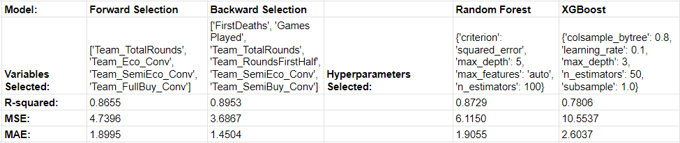
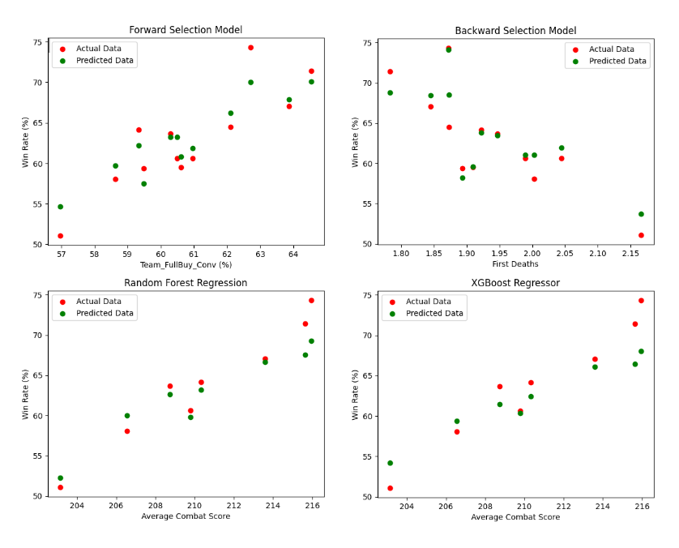

# Valorant Esports Winrate Prediction
The goal of this project is to find the best model to predict any teams' winrate and which statistics have highest correlation.

And to answer some questions:
1. Does more eco wins lead to game wins?
2. Does more semi-eco wins lead to game wins?
3. Does more full-buy wins lead to game wins?

Results are presented at the bottom of this page

## Tools Used
- Language: Python
- Data Cleaning: GCP - sqlite, pandas, numpy
- Data Modelling/Analysis: sklearn, statsmodels, mlxtend, xgboost
- Data Visualization: matplotlib, seaborn
- Dashboard: Tableau

## The Data
Raw dataset from Kaggle, approximaetly 200,000 rows
  Four tables: Game_Rounds, Game_Scoreboard, Games, Matches
    Original data source can be found at [Kaggle](https://www.kaggle.com/datasets/visualize25/valorant-pro-matches-full-data)
  Cleaned data can be found at [Data](https://github.com/marcowong3/valorant-esports-winrate-analysis/tree/main/data)

## Models & Errors

## Model Predictions

